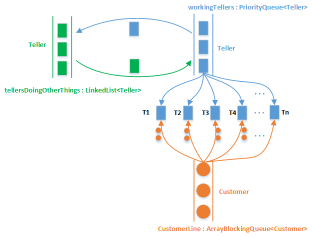
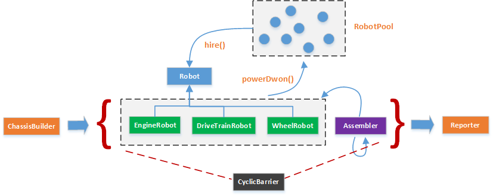

### 银行出纳员仿真

对象随机地出现，并且要求由数量有限的服务器提供随机数量的服务时间。通过构建仿真可以确定理想的服务器数量；

本例中：
- 每个银行顾客要求一定数量的服务时间，这是出纳员必须花费在顾客身上，以服务顾客要求的时间单位的数量；
- 服务时间的数量对每个顾客来说都是不同的，并且是随机确定的；
- 你不知道在每个时间间隔内有多少顾客会到达，因此这也是随机确定的；
- adjustTellerNumber() 在动态调整 服务顾客的 Teller 数量；该仿真系统 TellerManager 试图发现对于给定的顾客流，最优的出纳员数量是多少；

### 饭店仿真

1）总共有9种对象：Order，Plate，Customer，WaitPerson，Chef，Restaurant，RestaurantWithQueues，Food，Course；其中 Food，Course 两个类来自 【第19章 19.7 使用接口组织枚举】；

2）各类简介：
- Order：订单类，主要包含：Customer，WaitPerson，Food；
- Plate：由厨师提供的内容（当厨师准备好食物后会生产该类对象），主要包含：Order，Food；
- Customer：顾客类，主要包含：WaitPerson，placeSetting（SynchronousQueue<Plate>一个没有内部容量的阻塞队列，用以强调：任何时刻只能上一道菜的概念）；
    + deliver(plate)方法：从服务员中接过plate，表示服务员给该顾客上了一道菜；
- WaitPerson：服务员类，主要包含：Restaurant，filledOrders（BlockingQueue<Plate>保存从厨师那里拿到的plate）；
    + placeOrder(cust, food)方法：根据顾客的要求生成一份订单，后期会被厨师拿取；
- Chef：厨师类，主要包含：Restaurant；
- Restaurant：饭店类，主要包含：waitPersons（List<WaitPerson>），chefs（List<Chef>），orders（BlockingQueue<Order>）；
- RestaurantWithQueues：饭店仿真测试驱动类；
- Food：食物类，里面有多个枚举类型子类，表示不同的菜（每道菜中又有不同的内容）；
- Course：一道菜（类），是个枚举类，与Food关联使用；
- randomSelection()方法：随机选取一道菜；

### 分发工作

考虑一个假想的用于汽车的机器人组装线，每辆Car都将分多个阶段构建，从创建底盘开始，紧跟着是安装发动机、车厢和轮子；

本例中，Car将其所有方法都设置为 synchronized，这是多余的。因为在工厂内部，Car 是通过队列移动的，并且在任何时刻，只有一个任务能够在某辆车上工作。基本上，队列可以强制串行化地访问Car。

但这正是你可能会落入的陷阱——你可能会说“让我们尝试着通过不对Car类同步来进行优化，因为看起来Car在这里并不需要同步。”但是稍后，当这个系统连接到另一个需要Car被同步的系统时，它就会崩溃。

